# Commisionning and test plan for the first prototypes.

THIS DOCUMENT DESRIBES THE TEST PROCEDURE TO TEST A PROTOTYPE OF uVERTER.

THIS IS INDENDED FOR TRAINED AND SKILLED POWER ELECTRONICS TECHNICIANS. DO NOT ATTEMPT WITHOUT PROPER SKILLS, PPE AND ASSISTANCE.

DO NOT PROCEED ALONE WITH THIS TEST PROCEDURE.

## Overall system functional blocks

The micro-inverter is a cascaded power converter made of a DC/DC stage and a DC/AC stage.

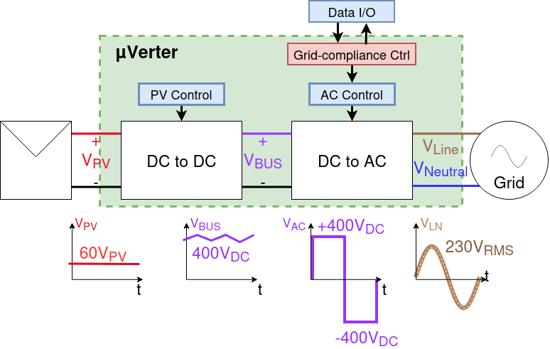

To validate the converter in a controlled way, the test procedure follows the functional dependency chain of a power converter instead of jumping directly to full-power operation.

A power converter can be structured around the five sub-blocks shown below:
- `Power`
- `Feeder`
- `Measurements`
- `Microcontroller`
- `Driver`

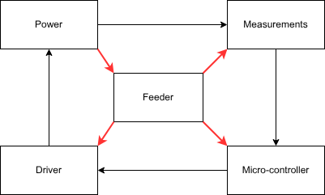

The progression used in this document is:

`bare-board safety -> feeder/power-up -> idle measurements -> microcontroller bring-up -> driver validation -> energized measurement validation -> DC/DC power stage -> DC/AC stage -> final assembly`

Each stage validates only the functions that should already be active at that point. This reduces risk, makes failures easier to localize, and provides a clear gate before moving to the next level of integration.

## State of the bare board before final assembly of sub-pcbs and non COTS parts

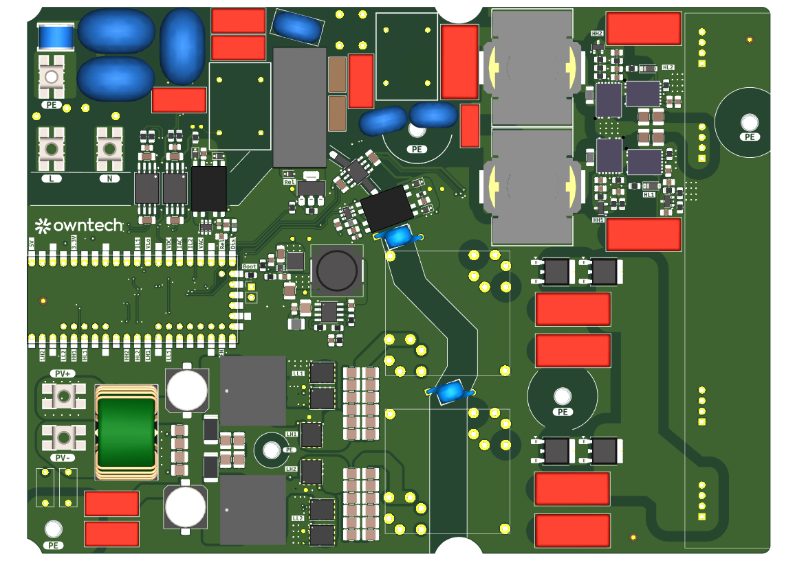

**SECURE THE BOARD MECHANICALLY ON AN ISOLATED WORKBENCH BEFORE STARTING**

| Test | Status | Title | Objective |
| --- | --- | --- | --- |
| 0   |     | Check for worst-case scenario | Validate bare-board isolation and confirm the board can be powered safely. |
| 1   |     | Low-side feeder characterization | Validate the feeder block by proving the auxiliary rails and reference used by the rest of the system. |
| 2   |     | Check measurements at idle state | Validate the measurement block at low risk by confirming offsets and nominal idle readings before active switching. |
| 3   |     | Assemble SPIN board and test relay | Validate the microcontroller block by flashing firmware and proving basic relay control. |
| 4   |     | Check PWM signals at the switch level | Validate the microcontroller-to-driver-to-power control path before integrating the power stages. |
| 5   |     | Check the gain and offsets for the measurements | Validate energized measurement and PLL inputs using controlled high-voltage DC and AC injection. |
| 6   |     | Assemble the two HF transformers | Validate the DC/DC power stage, including open-loop operation, regulation, and ZVS characterization. |
| 7   |     | DC/AC testing | Validate full DC/AC stage operation, synchronization, and generated sinewave behavior. |
| 8   |     | Mount capacitors and common-mode choke | Close the prototype assembly after the functional validation gates have been passed. |

### Test 0 Bare-board safety and worst-case checks

Objective: Validate that the board is electrically safe to power for the first time by checking the main isolation paths before any supply is applied.

Entry condition: board received from PCBA, mechanically secured, and not yet powered.

Exit condition: no critical short or unintended continuity remains on the main power and safety nodes.

Tool needed:
- Multimeter in ohmmeter mode

**System under test placeholder**

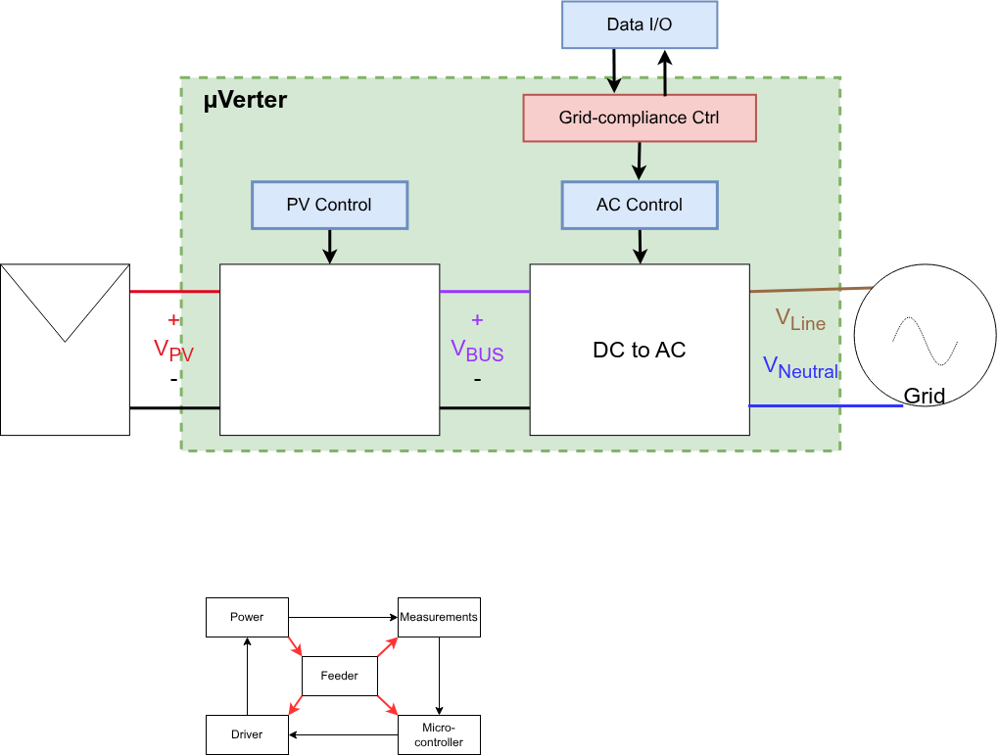
_System-under-test placeholder. Duplicate this figure and grey out blocks not under test for the final version._

**Sub-tests summary**

| Test | Title | State |
| --- | --- | --- |
| 0.1 | Check 12V-to-ground isolation | TO DO |
| 0.2 | Check 5V-to-ground isolation | TO DO |
| 0.3 | Check PV input isolation | TO DO |
| 0.4 | Check AC line-to-neutral isolation | TO DO |
| 0.5 | Check protective earth isolation | TO DO |

**Sub-tests**

0.1 - Check that the `12V` rail is not shorted to ground before any power-up attempt.

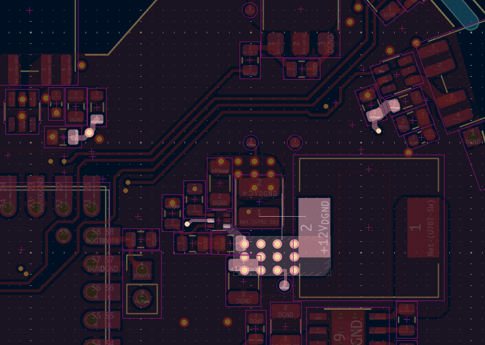

0.2 - Check that the `5V` rail is not shorted to ground before any power-up attempt.

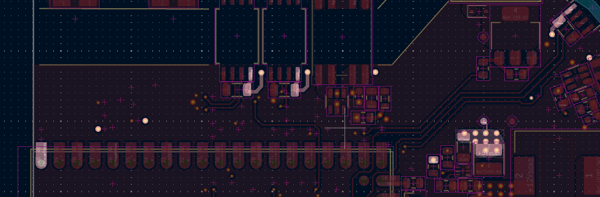

0.3 - Check that `PV+` and `PV-` are not shorted so the feeder input can be energized safely later.

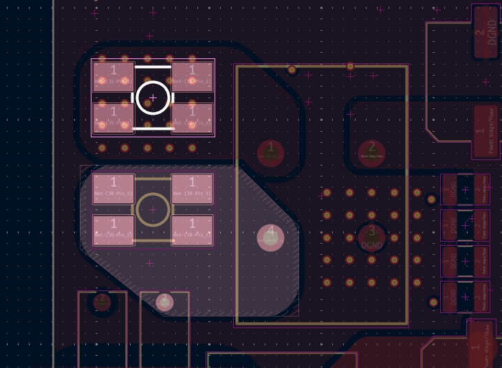

0.4 - Check that `L` and `N` are not shorted before any AC-side testing.

0.5 - Check that `PE`, `L`, `N`, `PV+`, and `PV-` do not show unintended continuity.

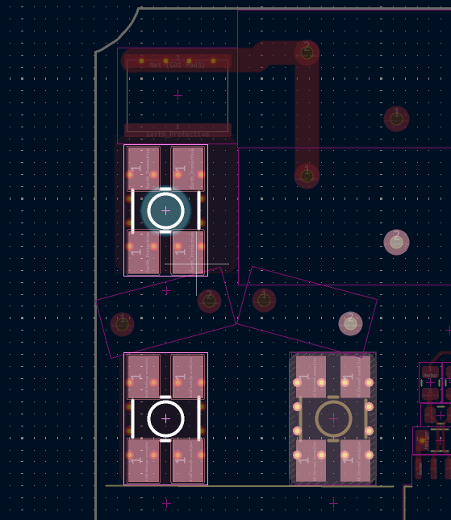

----
## Test 1 Low-side feeder characterization

Objective: Validate the feeder block by proving that the auxiliary rails and local reference are present, regulated, and usable by the rest of the board.

Entry condition: Test 0 completed successfully and the board is safe for first power-up.

Exit condition: all required low-voltage rails and the reference are available, stable, and characterized over the intended input range.

> List of materials
> - [ ] Thermal camera
> - [ ] Current limited voltage source
> - [ ] Cables
> - [ ] Screws or adaptors
> - [ ] Multimeter

> [!warning]
> Watch out for hot spots during first energization and during load sweeps.

**System under test placeholder**

_System-under-test placeholder. Duplicate this figure and grey out blocks not under test for the final version._

**Sub-tests summary**

| Test | Title | State | Deliverable(s) |
| --- | --- | --- | --- |
| 1.1 | Verify 12V_LV auxiliary rail start-up and regulation | TO DO | - |
| 1.2 | Verify 5V_DGND rail start-up and regulation | TO DO | - |
| 1.3 | Verify 12V_HV auxiliary rail start-up and regulation | TO DO | - |
| 1.4 | Verify 5V_ACsense rail start-up and regulation | TO DO | - |
| 1.5 | Verify 5V_HV rail start-up and regulation | TO DO | - |
| 1.6 | Verify 5V_SN1 rail start-up and regulation | TO DO | - |
| 1.7 | Verify 5V_SN2 rail start-up and regulation | TO DO | - |
| 1.8 | Verify 1.024V reference accuracy and stability | TO DO | - |
| 1.9 | Sweep input voltage and verify rail regulation from 10V to 70V | TO DO | D1.09 |
| 1.10 | Characterize 12V rail maximum load capability over input voltage | TO DO | D1.10, D1.11, D1.12 |
| 1.11 | Characterize 5V rail maximum load capability over input voltage | TO DO | D1.13, D1.14, D1.15 |

**Sub-tests**

1.1 - Power the board from the PV input and verify that the `12V_LV` rail starts correctly, reaches its nominal voltage, and remains stable under no-load conditions.
<!-- What is the input voltage level? -->
<!-- What is the "nominal" voltage level? -->

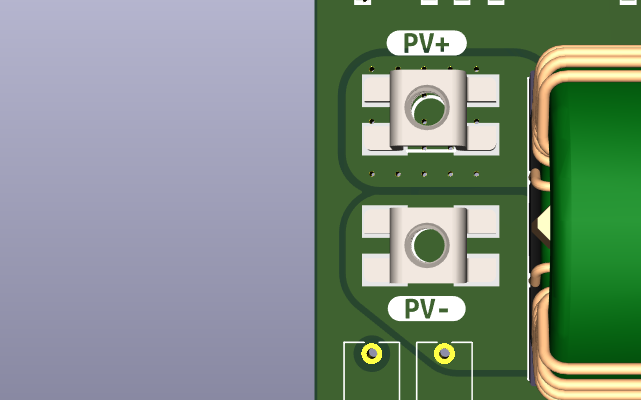
_PV connectors to be powered up_

_12V test points highlighted on the board_

1.2 - Verify that the `5V_DGND` rail is present at the expected voltage level and remains stable after start-up.

_5V test points highlighted on the board_

1.3 - Verify that the `12V_HV` rail is generated correctly and remains within its expected operating range.

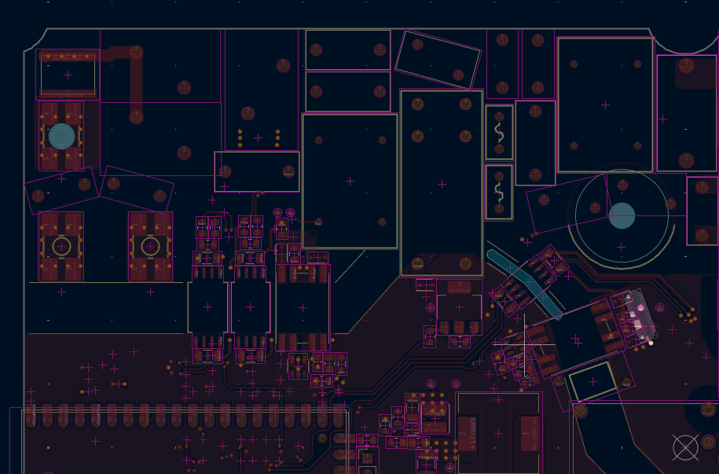
_12VH test points highlighted on the board_

1.4 - Verify that the `5V_ACsense` rail is available and correctly regulated for the sensing stage.

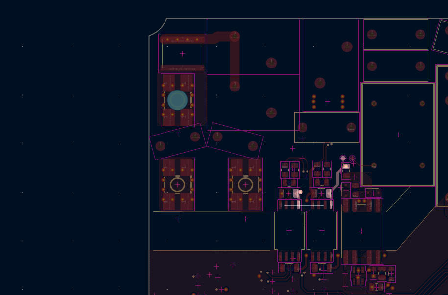
_5V_ACsens test points highlighted on the board_

1.5 - Verify that the `5V_HV` rail is present and stable at its nominal value.

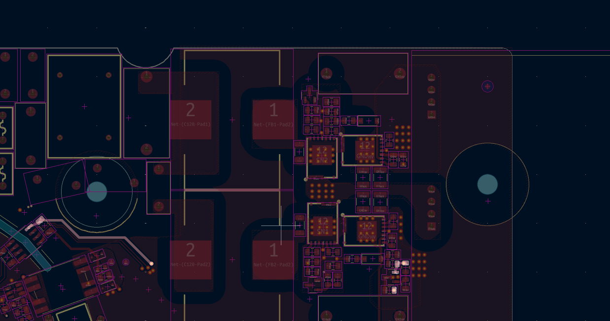
_5V_HV test points highlighted on the board_

1.6 - Verify that the `5V_SN1` rail is generated correctly and does not show abnormal drift or collapse.

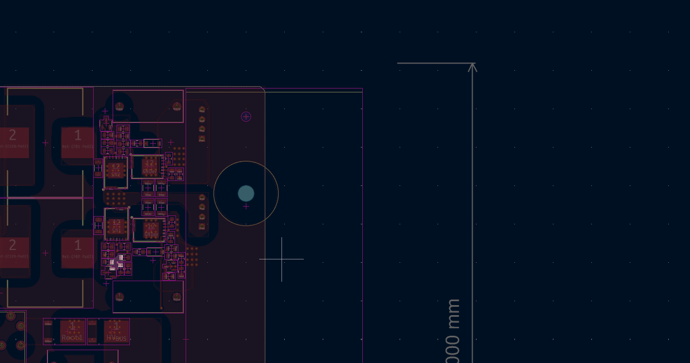
_5V_SN1 test points highlighted on the board_

1.7 - Verify that the `5V_SN2` rail is generated correctly and does not show abnormal drift or collapse.

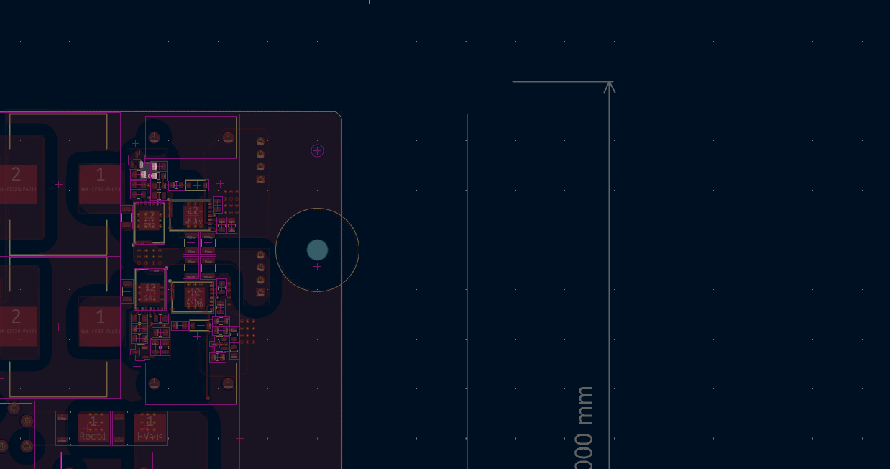
_5V_SN2 test points highlighted on the board_

1.8 - Measure the reference output and verify that `Vref` is `1.024V` within the acceptable tolerance and remains stable over time before depending on it for later measurements.

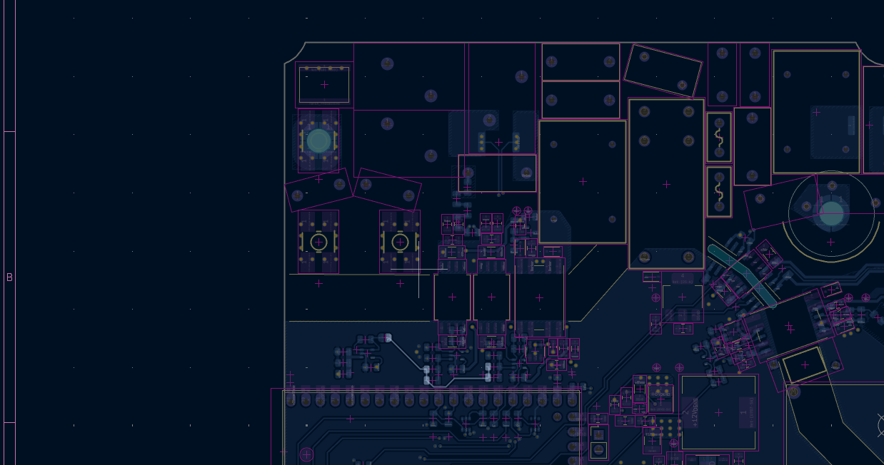
_Vref test points highlighted on the board_

*There might be an issue with capacitor loading of [TL431](https://www.lcsc.com/datasheet/C181103.pdf) that might place the regulator in unstable region. In that case, we will need to swap output capacitance to either lower or higher value.*

1.9 - Sweep the PV input voltage from `10V` to `70V` and verify that the feeder remains operational over the full range. Linked deliverable: **D1.09 - Plot of regulated output voltage versus input voltage (`Vout` against `Vin`)**.

1.10 - Add a resistive load to the `12V` rail and determine, for multiple `Vin` values from `10V` to `70V`, the maximum output power before the rail collapses or exceeds the admissible voltage drop. Linked deliverables: **D1.10 - Defined admissible voltage drop for the `12V` rail**, **D1.11 - Plot of maximum output power on the `12V` rail versus input voltage (`Pout_max` against `Vin`)**, **D1.12 - Plot of `12V` rail efficiency versus input voltage**.

1.11 - Add a resistive load to the `5V` rail and determine, for multiple `Vin` values from `10V` to `70V`, the maximum output power before the rail collapses or exceeds the admissible voltage drop. Linked deliverables: **D1.13 - Defined admissible voltage drop for the `5V` rail**, **D1.14 - Plot of maximum output power on the `5V` rail versus input voltage (`Pout_max` against `Vin`)**, **D1.15 - Plot of `5V` rail efficiency versus input voltage**.

**Deliverables**

| Deliverable | Linked Test | Description | State |
| --- | --- | --- | --- |
| D1.09 | 1.9 | Plot of regulated output voltage versus input voltage (`Vout` against `Vin`) | TO DO |
| D1.10 | 1.10 | Defined admissible voltage drop for the `12V` rail | TO DO |
| D1.11 | 1.10 | Plot of maximum output power on the `12V` rail versus input voltage (`Pout_max` against `Vin`) | TO DO |
| D1.12 | 1.10 | Plot of `12V` rail efficiency versus input voltage | TO DO |
| D1.13 | 1.11 | Defined admissible voltage drop for the `5V` rail | TO DO |
| D1.14 | 1.11 | Plot of maximum output power on the `5V` rail versus input voltage (`Pout_max` against `Vin`) | TO DO |
| D1.15 | 1.11 | Plot of `5V` rail efficiency versus input voltage | TO DO |

## Test 2 Check measurements at idle state

Objective: Validate the measurement block at low risk by confirming expected offsets and nominal idle readings before any active switching or high-energy conversion test.

Entry condition: Test 1 completed successfully and all required low-voltage rails are available and stable.

Exit condition: the main sensing channels show expected idle values and are ready to be used by the microcontroller in later tests.

**System under test placeholder**

_System-under-test placeholder. Duplicate this figure and grey out blocks not under test for the final version._

**Sub-tests summary**

| Test | Title | State |
| --- | --- | --- |
| 2.1 | Check DC input voltage sensor scaling | TO DO |
| 2.2 | Check I_Ilow1 zero-current offset | TO DO |
| 2.3 | Check I_Ilow2 zero-current offset | TO DO |
| 2.4 | Check V_DcHigh idle offset | TO DO |
| 2.5 | Check VAc idle offset | TO DO |
| 2.6 | Check I_Ac idle offset | TO DO |

**Sub-tests**

2.1 - Check that the DC input voltage sensor reports `1V` for a DC input of `40V`.

2.2 - Check that the `I_Ilow1` sensor value is about `0V` under no-input-current conditions.

2.3 - Check that the `I_Ilow2` sensor value is about `0V` under no-input-current conditions.

2.4 - Check that the `V_DcHigh` sensor value is about `0V` with no voltage on the `400V` bus.

2.5 - Check that the `VAc` sensor value is about `1V` with no voltage on the AC bus.

2.6 - Check that the `I_Ac` sensor value is about `1V` with no current on the AC bus.

## Test 3 Assemble SPIN board and test relay

Objective: Validate the microcontroller block by flashing firmware, proving the board boots correctly, and confirming the relay control path behaves as expected.

Entry condition: Tests 1 and 2 completed successfully so that power and idle sensing are already trusted.

Exit condition: the microcontroller can be programmed, boots correctly, and controls the relay in a known safe way.

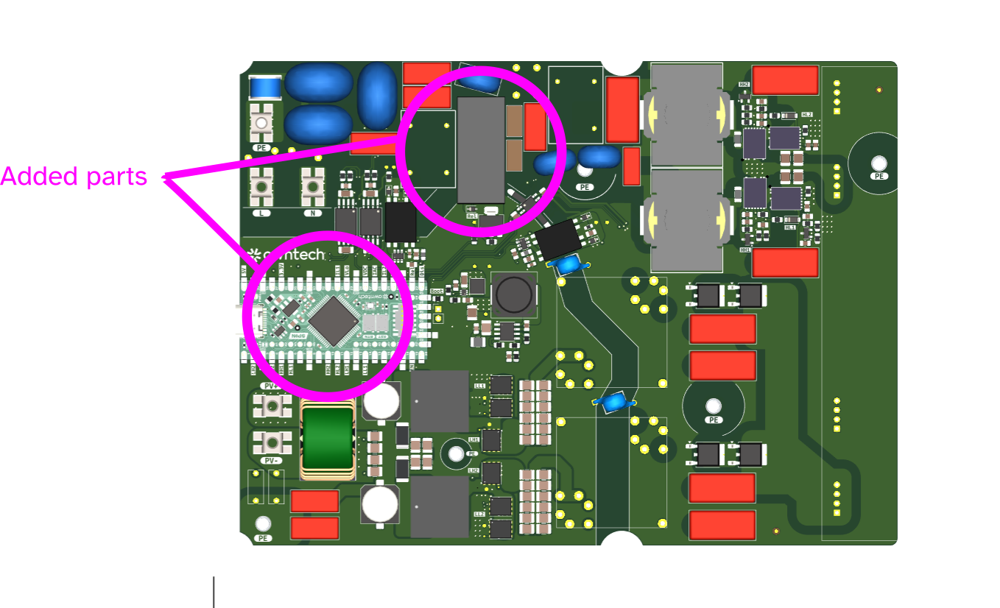

**System under test placeholder**

_System-under-test placeholder. Duplicate this figure and grey out blocks not under test for the final version._

**Sub-tests summary**

| Test | Title | State |
| --- | --- | --- |
| 3.1 | Flash firmware | TO DO |
| 3.2 | Verify relay default open state | TO DO |
| 3.3 | Verify relay actuation control | TO DO |

**Sub-tests**

3.1 - Flash firmware and confirm that the microcontroller starts from the intended software baseline for the following validation steps.

3.2 - Verify that by default the relay is **OPEN (NOT connected)** so the system remains in a safe state at boot.

3.3 - Verify that the SPIN board is able to close and open the contact on command.

## Test 4 Check PWM signals at the switch level

Objective: Validate the control path from the microcontroller to the driver and into the power stage before proceeding to higher-energy conversion tests.

Entry condition: Test 3 completed successfully and the microcontroller is available to generate the required control signals.

Exit condition: PWM generation, isolation, polarity, and observed switch-node behavior are consistent with the intended driver operation.

> [!warning]
> Dangerous test. Make sure you fully understand the setup, probe references, and expected switching behavior before proceeding. Do not perform this test alone.

**System under test placeholder**

_System-under-test placeholder. Duplicate this figure and grey out blocks not under test for the final version._

**Sub-tests summary**

| Test | Title | State |
| --- | --- | --- |
| 4.1 | Verify low-side switch operation | TO DO |
| 4.2 | Verify boost capacitor voltage behavior | TO DO |
| 4.3 | Verify PWM propagation through isolator | TO DO |
| 4.4 | Verify PWM polarity through isolator | TO DO |

**Sub-tests**

4.1 - Use the test points provided for the low-side switch and verify that the switches operate correctly. Mind that they are not all on the same voltage reference when testing.

4.2 - Check the capacitor voltage to verify the boost effect of the T-Type half-bridge topology. Mind that they are not all on the same voltage reference when testing. **BE CAREFUL, IT IS A BOOST**. If your PWM signals are too high, the boost ratio can be really high without load.

4.3 - Test that the PWM signals are correctly present after the isolator for the DC/AC topology.

4.4 - Check that the polarity of the PWM is the same before and after the isolator. Mind that they are not all on the same voltage reference when testing.

### Test 5 Check the gain and offsets for the measurements

Objective: Validate the measurement block under energized conditions by applying controlled high-voltage DC and AC inputs and confirming that the microcontroller receives correct sensing information.

Entry condition: Tests 1 through 4 completed successfully so that feeder, idle measurements, microcontroller, and driver behavior are already understood.

Exit condition: high-voltage DC sensing, AC sensing, and PLL-related measurement behavior are validated without yet running full power conversion.

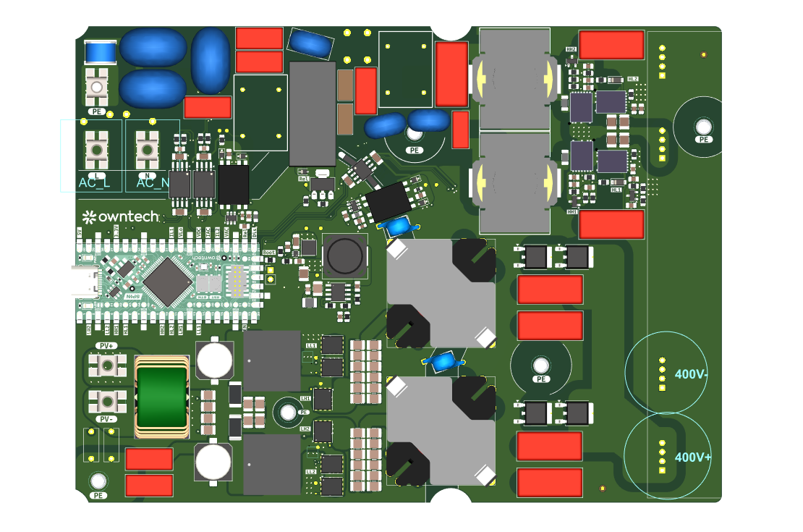

**System under test placeholder**

_System-under-test placeholder. Duplicate this figure and grey out blocks not under test for the final version._

**Sub-tests summary**

| Test | Title | State |
| --- | --- | --- |
| 5.1 | Isolate DC sensor input from DC/AC stage | TO DO |
| 5.2 | Verify DC/AC to DC/DC isolation continuity | TO DO |
| 5.3 | Inject 400V on capacitor bank | TO DO |
| 5.4 | Verify 400V VDc bus sensor reading | TO DO |
| 5.5 | Inject 230V AC input | TO DO |
| 5.6 | Verify 230VRms and 50Hz sensor reading | TO DO |
| 5.7 | Check PLL behavior | TO DO |

**Sub-tests**

5.1 - Isolate the last resistance from the DC sensor so it is connected to the output of the DC/DC stage. This prepares the energized sensing test while keeping the DC/DC and DC/AC stages separated.

This way, the DCDC stage is fully disconnected from the DC/AC stage and you can test the DC/DC stage with more peace of mind.

5.2 - Check that there is no more continuity between DC/AC input and DC/DC output before applying energized stimuli.

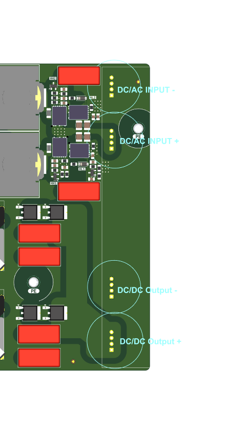

> [!warning]
> Dangerous test. Make sure you fully understand the setup, PPE, isolation, and discharge procedure before injecting high voltage. Do not perform this test alone.

5.3 - Inject `400V` on the capacitor bank as shown below in order to energize the DC sensing path.

5.4 - Make sure the microcontroller reads `400V` on the `VDc` bus sensor.

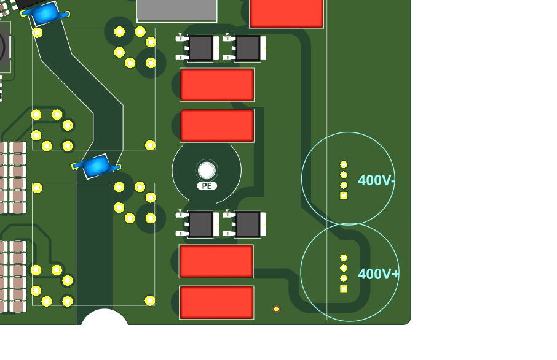

> [!warning]
> Dangerous test. Make sure you fully understand the AC injection setup, isolation, and probe references before proceeding. Do not perform this test alone.

5.5 - Inject `230V`, `50Hz` as shown below in order to energize the AC sensing path.

5.6 - Make sure the microcontroller reads `230VRms` and `50Hz` on the AC sensing path.

5.7 - Check the PLL behavior using the injected AC input.

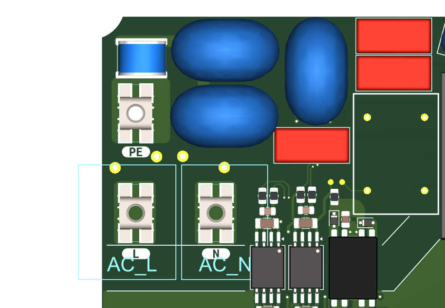

**NOW DISCONNECT THE 230V. WE DO NOT NEED IT TO TEST DC/DC STAGE**

### Test 6 Assemble the two HF transformers

Objective: Validate the DC/DC power stage by preparing the hardware, running controlled open-loop testing, and characterizing regulation and ZVS behavior.

Entry condition: Tests 1 through 5 completed successfully and the feeder, measurement, microcontroller, driver, and energized sensing paths are already validated.

Exit condition: the DC/DC stage can be exercised in a controlled way, reaches the target output, and produces the required characterization data before final transformer closure.

**System under test placeholder**

_System-under-test placeholder. Duplicate this figure and grey out blocks not under test for the final version._

**Sub-tests summary**

| Test | Title | State |
| --- | --- | --- |
| 6.1 | Add current-probe series wire | TO DO |
| 6.2 | Install 250W rheostat on 400V bus | TO DO |
| 6.3 | Run DCDC open-loop test code | TO DO |
| 6.4 | Raise duty cycle to 400V output | TO DO |
| 6.5 | Verify 400V output regulation | TO DO |
| 6.6 | Verify ZVS operation | TO DO |
| 6.7 | Finalize transformer installation | TO DO |

**Sub-tests**

6.1 - **DO add a series wire between the primary side and MOSFETs to place an oscilloscope current probe**. This setup is required before any actuation because the ZVS verification depends on it.

This is important to test ZVS functionality.

> [!warning]
> Dangerous test. Make sure you fully understand the setup, the expected converter behavior, and the discharge procedure before energizing the stage. Do not perform this test alone.

**Make sure you have a thermal camera when doing first tests**

6.2 - Add a `250W` rheostat rated for `230V` between `400V-` and `400V+` so the DC/DC output can be exercised under controlled load.

Electronics load disturbs efficiency test.

6.3 - Run the DCDC test code. That is the code with the open-loop boost and variable dead-time.

6.4 - Increase slowly the duty cycle until the converter reaches `400V` on the output.

6.5 - Verify that the DC/DC stage stabilizes the output voltage at `400V`.

6.6 - Follow the test procedure to verify that the converter operates under ZVS.

**Retrieve datapoints and publish a plot with P_ZVS against Vin**

**Retrieve datapoints and publish a plot with efficiency against Vin**

6.7 - When characterization is properly done and data properly saved, remove the wire and install the transformer completely.

## Test 7 DC/AC testing

Objective: Validate the DC/AC stage as an integrated function by confirming sensing, PLL behavior, relay state, inverter start-up, generated sinewave, and synchronization.

Entry condition: Tests 1 through 6 completed successfully and the DC/DC stage has already been characterized in a controlled way.

Exit condition: the DC/AC stage starts correctly, produces the expected waveform, and synchronizes correctly with the grid-side reference.

> [!warning]
> Dangerous test. Make sure you fully understand the AC and DC sources, probe references, and synchronization measurements before proceeding. Do not perform this test alone.

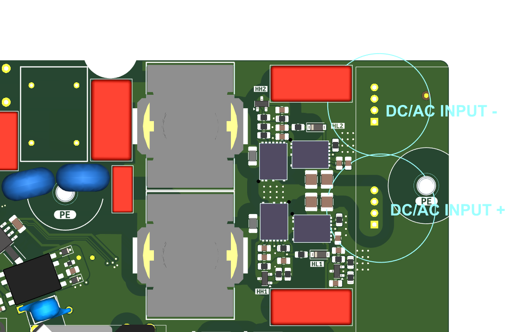

**System under test placeholder**

_System-under-test placeholder. Duplicate this figure and grey out blocks not under test for the final version._

**Sub-tests summary**

| Test | Title | State |
| --- | --- | --- |
| 7.1 | Inject 400V DC supply | TO DO |
| 7.2 | Inject 230V AC supply | TO DO |
| 7.3 | Check PLL behavior | TO DO |
| 7.4 | Verify relay remains open | TO DO |
| 7.5 | Start inverter and monitor thermals | TO DO |
| 7.6 | Measure generated sinewave | TO DO |
| 7.7 | Verify grid synchronization | TO DO |

**Sub-tests**

7.1 - Inject `400V` using preferably a lab bench supply with current-limiting capabilities.

7.2 - Inject `230V` using preferably an isolation transformer.

7.3 - Check PLL once again with both external supplies present.

7.4 - Make sure the relay stays **OPEN (NOT connected)** before inverter start-up.

7.5 - Start the inverter. **Make sure to look at the layout with a thermal camera**.

7.6 - Measure the generated sinewave.

7.7 - Check synchronization between the grid side and the inverter output. They should be perfectly in sync. Think twice about how to do the measurement with isolated probes.

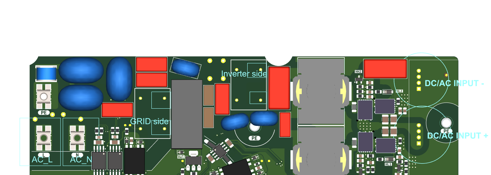

## Test 8 Mount capacitors, and common-mode choke

Objective: Complete the assembly only after the main functional validation steps have succeeded and confirm the prototype is ready for the next level of integration.

Entry condition: Tests 0 through 7 completed successfully and the major converter functions have already been validated.

Exit condition: the final passive parts are mounted and the board is ready for integration testing as a fully assembled prototype.

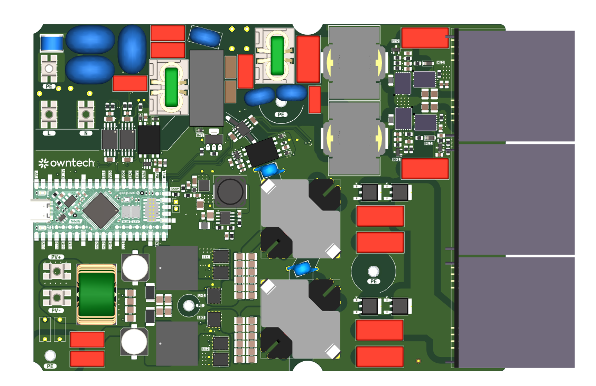

**System under test placeholder**

_System-under-test placeholder. Duplicate this figure and grey out blocks not under test for the final version._

**Sub-tests summary**

| Test | Title | State |
| --- | --- | --- |
| 8.1 | Mount common-mode choke and PP capacitors | TO DO |
| 8.2 | Confirm readiness for integration test | TO DO |

**Sub-tests**

8.1 - Mount common-mode choke and PP capacitors after the earlier functional gates have been passed.

8.2 - Confirm that the board is ready for integration testing.

