# Commisionning and test plan for the first prototypes.

THIS DOCUMENT DESRIBES THE TEST PROCEDURE TO TEST A PROTOTYPE OF uVERTER.

THIS IS INDENDED FOR TRAINED AND SKILLED POWER ELECTRONICS TECHNICIANS. DO NOT ATTEMPT WITHOUT PROPER SKILLS, PPE AND ASSISTANCE.

DO NOT PROCEED ALONE WITH THIS TEST PROCEDURE.

---
## Table of contents

- [Commisionning and test plan for the first prototypes.](#commisionning-and-test-plan-for-the-first-prototypes)
  - [Table of contents](#table-of-contents)
  - [Overall system functional blocks](#overall-system-functional-blocks)
  - [Testing strategy and progression](#testing-strategy-and-progression)
  - [Test 0 Bare-board safety and worst-case checks](#test-0-bare-board-safety-and-worst-case-checks)
  - [Test 1 Low-side feeder characterization](#test-1-low-side-feeder-characterization)
    - [Sub-tests Description](#sub-tests-description)
  - [Test 2 Check measurements at idle state](#test-2-check-measurements-at-idle-state)
  - [Test 3 Assemble SPIN board and test relay](#test-3-assemble-spin-board-and-test-relay)
  - [Test 4 Check PWM signals at the switch level](#test-4-check-pwm-signals-at-the-switch-level)
  - [Test 5 Check the gain and offsets for the measurements](#test-5-check-the-gain-and-offsets-for-the-measurements)
  - [Test 6 Validate the DC/DC power stage](#test-6-validate-the-dcdc-power-stage)
  - [Test 7 DC/AC testing](#test-7-dcac-testing)
  - [Test 8 Mount capacitors, and common-mode choke](#test-8-mount-capacitors-and-common-mode-choke)

---
## Overall system functional blocks

The micro-inverter is a cascaded power converter made of a DC/DC stage and a DC/AC stage.

To validate the converter in a controlled way, the test procedure follows the functional dependency chain of a power converter instead of jumping directly to full-power operation.

A power converter can be structured around the five sub-blocks shown below:
- `Power`
- `Feeder`
- `Measurements`
- `Microcontroller`
- `Driver`

---
## Testing strategy and progression

The progression used in this document is:

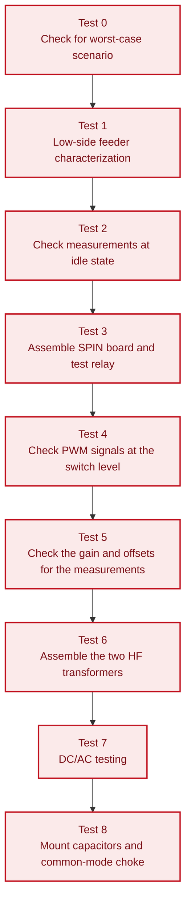
```mermaid
flowchart TD
    A["Test 0<br/>Check for worst-case scenario"] --> B["Test 1<br/>Low-side feeder characterization"]
    B --> C["Test 2<br/>Check measurements at idle state"]
    C --> D["Test 3<br/>Assemble SPIN board and test relay"]
    D --> E["Test 4<br/>Check PWM signals at the switch level"]
    E --> F["Test 5<br/>Check the gain and offsets for the measurements"]
    F --> G["Test 6<br/>Assemble the two HF transformers"]
    G --> H["Test 7<br/>DC/AC testing"]
    H --> I["Test 8<br/>Mount capacitors and common-mode choke"]

    classDef todo fill:#fbeaea,stroke:#c1121f,color:#7a0f17,stroke-width:2px;
    classDef ongoing fill:#fff4d6,stroke:#d97706,color:#8a4b00,stroke-width:2px;
    classDef done fill:#e8f5e9,stroke:#2e7d32,color:#1b5e20,stroke-width:2px;

    class A todo;
    class B todo;
    class C todo;
    class D todo;
    class E todo;
    class F todo;
    class G todo;
    class H todo;
    class I todo;

    click A href "(#overall-system-functional-blocks)" _self
    click B href "#test-1" "Go to Test 1"
    click C href "#test-2" "Go to Test 2"
    click D href "#test-3" "Go to Test 3"
    click E href "#test-4" "Go to Test 4"
    click F href "#test-5" "Go to Test 5"
    click G href "#test-6" "Go to Test 6"
    click H href "#test-7" "Go to Test 7"
    click I href "#test-8" "Go to Test 8"
```

Each stage validates only the functions that should already be active at that point. This reduces risk, makes failures easier to localize, and provides a clear gate before moving to the next level of integration.

 
| Test | Status | Title | Objective |
| --- | --- | --- | --- |
| 0   |     | Check for worst-case scenario | Validate bare-board isolation and confirm the board can be powered safely. |
| 1   |     | Low-side feeder characterization | Validate the feeder block by proving the auxiliary rails and reference used by the rest of the system. |
| 2   |     | Check measurements at idle state | Validate the measurement block at low risk by confirming offsets and nominal idle readings before active switching. |
| 3   |     | Assemble SPIN board and test relay | Validate the microcontroller block by flashing firmware and proving basic relay control. |
| 4   |     | Check PWM signals at the switch level | Validate the microcontroller-to-driver-to-power control path before integrating the power stages. |
| 5   |     | Check the gain and offsets for the measurements | Validate energized measurement and PLL inputs using controlled high-voltage DC and AC injection. |
| 6   |     | Assemble the two HF transformers | Validate the DC/DC power stage, including open-loop operation, regulation, and ZVS characterization. |
| 7   |     | DC/AC testing | Validate full DC/AC stage operation, synchronization, and generated sinewave behavior. |
| 8   |     | Mount capacitors and common-mode choke | Close the prototype assembly after the functional validation gates have been passed. |

-----

## Test 0 Bare-board safety and worst-case checks

| Item | Description |
| --- | --- |
| Objective | Validate that the board is electrically safe to power for the first time by checking the main isolation paths before any supply is applied. |
| Entry condition | board received from PCBA, mechanically secured, and not yet powered. |
| Exit condition | no critical short or unintended continuity remains on the main power and safety nodes. |

> List of materials
> - [ ] Multimeter in ohmmeter mode
> - [ ] Test leads
> - [ ] Board support or insulated work surface

**System function view for this test**

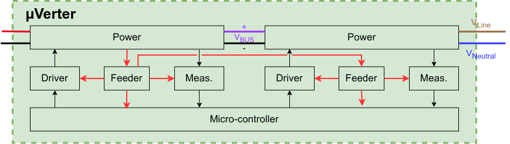
_Functions under test : The links between the parts_

**Board during test**

_View of the board during the test procedure_

**Sub-tests summary**

| Test | Title | State |
| --- | --- | --- |
| 0.1 | Check 12V-to-ground isolation | TO DO |
| 0.2 | Check 5V-to-ground isolation | TO DO |
| 0.3 | Check PV input isolation | TO DO |
| 0.4 | Check AC line-to-neutral isolation | TO DO |
| 0.5 | Check protective earth isolation | TO DO |

**Sub-tests**

0.1 - Check that the `12V` rail is not shorted to ground before any power-up attempt.

0.2 - Check that the `5V` rail is not shorted to ground before any power-up attempt.

0.3 - Check that `PV+` and `PV-` are not shorted so the feeder input can be energized safely later.

0.4 - Check that `L` and `N` are not shorted before any AC-side testing.

0.5 - Check that `PE`, `L`, `N`, `PV+`, and `PV-` do not show unintended continuity.

-----

## Test 1 Low-side feeder characterization

| Item | Description |
| --- | --- |
| Objective | Validate the feeder block by proving that the auxiliary rails and local reference are present, regulated, and usable by the rest of the board. |
| Entry condition | Test 0 completed successfully and the board is safe for first power-up. |
| Exit condition | all required low-voltage rails and the reference are available, stable, and characterized over the intended input range. |

> List of materials
> - [ ] Thermal camera
> - [ ] Current limited voltage source
> - [ ] Cables
> - [ ] Screws or adaptors
> - [ ] Multimeter

> [!warning]
> Watch out for hot spots during first energization and during load sweeps.

**System function view for this test**

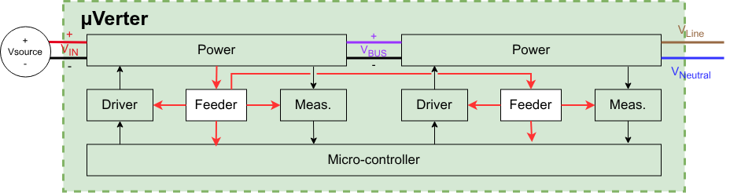
_Functions under test: both feeder sides._

**Board during test**

_Board during the test procedure: no changes_

**Sub-tests summary**

| Test | Title | State | Deliverable(s) |
| --- | --- | --- | --- |
| 1.1 | Verify 12V_LV auxiliary rail start-up and regulation | TO DO | - |
| 1.2 | Verify 5V_DGND rail start-up and regulation | TO DO | - |
| 1.3 | Verify 12V_HV auxiliary rail start-up and regulation | TO DO | - |
| 1.4 | Verify 5V_ACsense rail start-up and regulation | TO DO | - |
| 1.5 | Verify 5V_HV rail start-up and regulation | TO DO | - |
| 1.6 | Verify 5V_SN1 rail start-up and regulation | TO DO | - |
| 1.7 | Verify 5V_SN2 rail start-up and regulation | TO DO | - |
| 1.8 | Verify 1.024V reference accuracy and stability | TO DO | - |
| 1.9 | Sweep input voltage and verify rail regulation from 10V to 70V | TO DO | D1.09 |
| 1.10 | Characterize 12V rail maximum load capability over input voltage | TO DO | D1.10, D1.11, D1.12 |
| 1.11 | Characterize 5V rail maximum load capability over input voltage | TO DO | D1.13, D1.14, D1.15 |

**Deliverables**

| Deliverable | Linked Test | Description | State |
| --- | --- | --- | --- |
| D1.09 | 1.9 | Plot of regulated output voltage versus input voltage (`Vout` against `Vin`) | TO DO |
| D1.10 | 1.10 | Defined admissible voltage drop for the `12V` rail | TO DO |
| D1.11 | 1.10 | Plot of maximum output power on the `12V` rail versus input voltage (`Pout_max` against `Vin`) | TO DO |
| D1.12 | 1.10 | Plot of `12V` rail efficiency versus input voltage | TO DO |
| D1.13 | 1.11 | Defined admissible voltage drop for the `5V` rail | TO DO |
| D1.14 | 1.11 | Plot of maximum output power on the `5V` rail versus input voltage (`Pout_max` against `Vin`) | TO DO |
| D1.15 | 1.11 | Plot of `5V` rail efficiency versus input voltage | TO DO |

### Sub-tests Description

1.1 - Power the board from the PV input and verify that the `12V_LV` rail starts correctly, reaches its nominal voltage, and remains stable under no-load conditions.
<!-- What is the input voltage level? -->
<!-- What is the "nominal" voltage level? -->

_PV connectors to be powered up_

_12V test points highlighted on the board_

1.2 - Verify that the `5V_DGND` rail is present at the expected voltage level and remains stable after start-up.

_5V test points highlighted on the board_

1.3 - Verify that the `12V_HV` rail is generated correctly and remains within its expected operating range.

_12VH test points highlighted on the board_

1.4 - Verify that the `5V_ACsense` rail is available and correctly regulated for the sensing stage.

_5V_ACsens test points highlighted on the board_

1.5 - Verify that the `5V_HV` rail is present and stable at its nominal value.

_5V_HV test points highlighted on the board_

1.6 - Verify that the `5V_SN1` rail is generated correctly and does not show abnormal drift or collapse.

_5V_SN1 test points highlighted on the board_

1.7 - Verify that the `5V_SN2` rail is generated correctly and does not show abnormal drift or collapse.

_5V_SN2 test points highlighted on the board_

1.8 - Measure the reference output and verify that `Vref` is `1.024V` within the acceptable tolerance and remains stable over time before depending on it for later measurements.

_Vref test points highlighted on the board_

*There might be an issue with capacitor loading of [TL431](https://www.lcsc.com/datasheet/C181103.pdf) that might place the regulator in unstable region. In that case, we will need to swap output capacitance to either lower or higher value.*

1.9 - Sweep the PV input voltage from `10V` to `70V` and verify that the feeder remains operational over the full range. Linked deliverable: **D1.09 - Plot of regulated output voltage versus input voltage (`Vout` against `Vin`)**.

1.10 - Add a resistive load to the `12V` rail and determine, for multiple `Vin` values from `10V` to `70V`, the maximum output power before the rail collapses or exceeds the admissible voltage drop. Linked deliverables: **D1.10 - Defined admissible voltage drop for the `12V` rail**, **D1.11 - Plot of maximum output power on the `12V` rail versus input voltage (`Pout_max` against `Vin`)**, **D1.12 - Plot of `12V` rail efficiency versus input voltage**.

1.11 - Add a resistive load to the `5V` rail and determine, for multiple `Vin` values from `10V` to `70V`, the maximum output power before the rail collapses or exceeds the admissible voltage drop. Linked deliverables: **D1.13 - Defined admissible voltage drop for the `5V` rail**, **D1.14 - Plot of maximum output power on the `5V` rail versus input voltage (`Pout_max` against `Vin`)**, **D1.15 - Plot of `5V` rail efficiency versus input voltage**.

-----

## Test 2 Check measurements at idle state

| Item | Description |
| --- | --- |
| Objective | Validate the measurement block at low risk by confirming expected offsets and nominal idle readings before any active switching or high-energy conversion test. |
| Entry condition | Test 1 completed successfully and all required low-voltage rails are available and stable. |
| Exit condition | the main sensing channels show expected idle values and are ready to be used by the microcontroller in later tests. |

> List of materials
> - [ ] Current limited DC source
> - [ ] Multimeter
> - [ ] Oscilloscope
> - [ ] Probe leads and clips
> - [ ] Cables and adaptors

**System function view for this test**

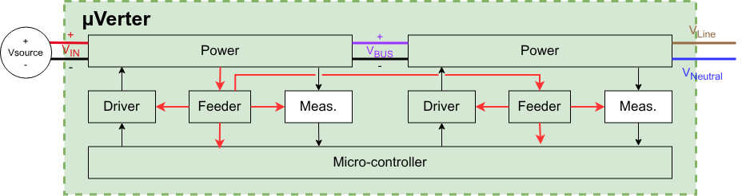
_Functions under test: The measurements on both sides._

**Board during test**

_Board during the test procedure: no changes_

**Sub-tests summary**

| Test | Title | State |
| --- | --- | --- |
| 2.1 | Check DC input voltage sensor scaling | TO DO |
| 2.2 | Check I_Ilow1 zero-current offset | TO DO |
| 2.3 | Check I_Ilow2 zero-current offset | TO DO |
| 2.4 | Check V_DcHigh idle offset | TO DO |
| 2.5 | Check VAc idle offset | TO DO |
| 2.6 | Check I_Ac idle offset | TO DO |

**Sub-tests**

2.1 - Check that the DC input voltage sensor reports `1V` for a DC input of `40V`.

2.2 - Check that the `I_Ilow1` sensor value is about `0V` under no-input-current conditions.

2.3 - Check that the `I_Ilow2` sensor value is about `0V` under no-input-current conditions.

2.4 - Check that the `V_DcHigh` sensor value is about `0V` with no voltage on the `400V` bus.

2.5 - Check that the `VAc` sensor value is about `1V` with no voltage on the AC bus.

2.6 - Check that the `I_Ac` sensor value is about `1V` with no current on the AC bus.

-----

## Test 3 Assemble SPIN board and test relay

| Item | Description |
| --- | --- |
| Objective | Validate the microcontroller block by flashing firmware, proving the board boots correctly, and confirming the relay control path behaves as expected. |
| Entry condition | Tests 1 and 2 completed successfully so that power and idle sensing are already trusted. |
| Exit condition | the microcontroller can be programmed, boots correctly, and controls the relay in a known safe way. |

> List of materials
> - [ ] SPIN board
> - [ ] Programming cable or debug probe
> - [ ] Computer with firmware tools
> - [ ] Power source for board bring-up
> - [ ] Multimeter or oscilloscope

**System function view for this test**

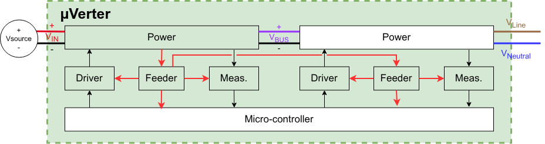
_Functions under test: the spin board and the relay of the high voltage power._

**Board during test**

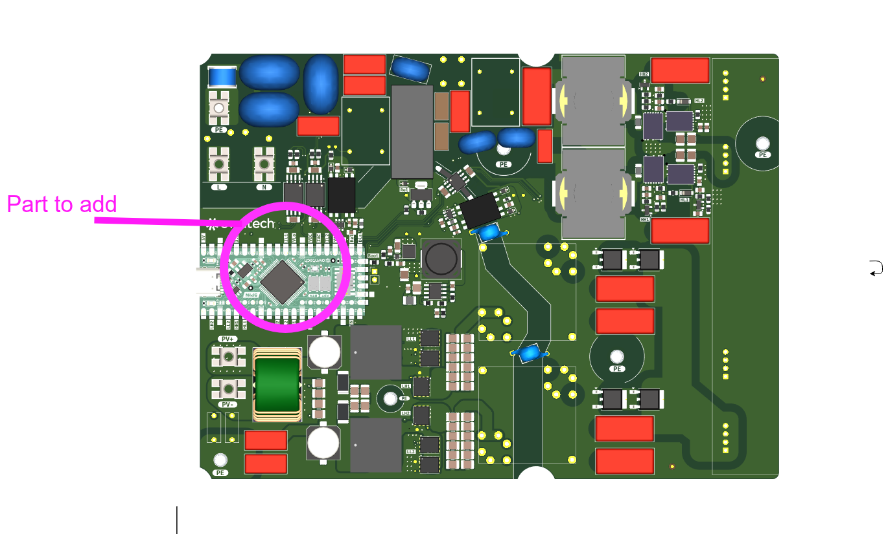
_Board during the test procedure: spin and relay added_

**Sub-tests summary**

| Test | Title | State |
| --- | --- | --- |
| 3.1 | Flash firmware | TO DO |
| 3.2 | Verify relay default open state | TO DO |
| 3.3 | Verify relay actuation control | TO DO |

**Sub-tests**

3.1 - Flash firmware and confirm that the microcontroller starts from the intended software baseline for the following validation steps.

3.2 - Verify that by default the relay is **OPEN (NOT connected)** so the system remains in a safe state at boot.

3.3 - Verify that the SPIN board is able to close and open the contact on command.

-----

## Test 4 Check PWM signals at the switch level

| Item | Description |
| --- | --- |
| Objective | Validate the control path from the microcontroller to the driver and into the power stage before proceeding to higher-energy conversion tests. |
| Entry condition | Test 3 completed successfully and the microcontroller is available to generate the required control signals. |
| Exit condition | PWM generation, isolation, polarity, and observed switch-node behavior are consistent with the intended driver operation. |

> List of materials
> - [ ] Oscilloscope
> - [ ] Isolated or differential probes
> - [ ] Probe accessories and ground references
> - [ ] Firmware or test code that generates PWM
> - [ ] Thermal camera

> [!warning]
> Dangerous test. Make sure you fully understand the setup, probe references, and expected switching behavior before proceeding. Do not perform this test alone.
> The `VBus` will be energized via the boost converter. Make sure you take all the precautions to stay safe.

**System function view for this test**

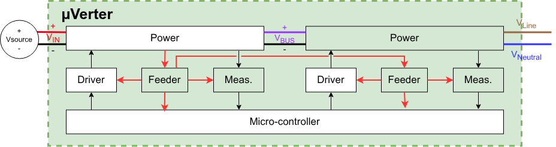
_Functions under test: The driver_

**Board during test**

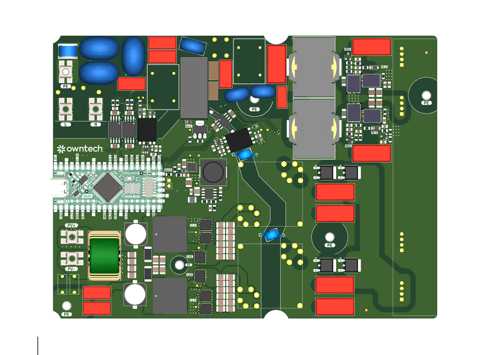
_Board during the test procedure: no change_

**Sub-tests summary**

| Test | Title | State |
| --- | --- | --- |
| 4.1 | Verify low-side switch operation | TO DO |
| 4.2 | Verify boost capacitor voltage behavior | TO DO |
| 4.3 | Verify PWM propagation through isolator | TO DO |
| 4.4 | Verify PWM polarity through isolator | TO DO |

**Sub-tests**

4.1 - Use the test points provided for the low-side switch and verify that the switches operate correctly. Mind that they are not all on the same voltage reference when testing.

4.2 - Check the capacitor voltage to verify the boost effect of the T-Type half-bridge topology. Mind that they are not all on the same voltage reference when testing. **BE CAREFUL, IT IS A BOOST**. If your PWM signals are too high, the boost ratio can be really high without load.

4.3 - Test that the PWM signals are correctly present after the isolator for the DC/AC topology.

4.4 - Check that the polarity of the PWM is the same before and after the isolator. Mind that they are not all on the same voltage reference when testing.

----

## Test 5 Check the gain and offsets for the measurements

| Item | Description |
| --- | --- |
| Objective | Validate the measurement block under energized conditions by applying controlled high-voltage DC and AC inputs and confirming that the microcontroller receives correct sensing information. |
| Entry condition | Tests 1 through 4 completed successfully so that feeder, idle measurements, microcontroller, and driver behavior are already understood. |
| Exit condition | high-voltage DC sensing, AC sensing, and PLL-related measurement behavior are validated without yet running full power conversion. |

> List of materials
> - [ ] 2 Multimeters
> - [ ] Oscilloscope
> - [ ] High-voltage DC source for `400V` injection
> - [ ] AC source or isolation transformer for `230V`, `50Hz` injection
> - [ ] Insulated probes and leads
> - [ ] PPE for high-voltage handling
> - [ ] A code that shows the raw data measurements from the micro-controller

> [!warning]
> Dangerous test. Make sure you fully understand the setup, probe references, and expected switching behavior before proceeding. Do not perform this test alone.
> The `VBus` will be energized via the boost converter. Make sure you take all the precautions to stay safe.

**System function view for this test**

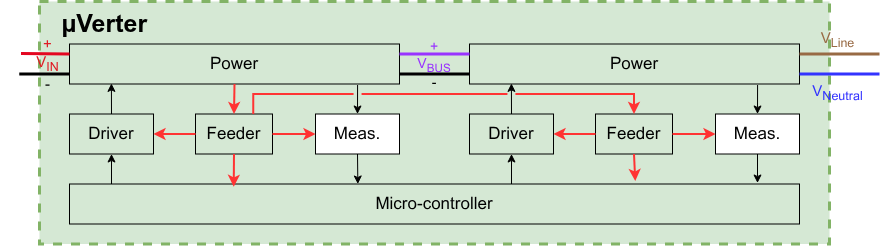
_Functions under test: measurement verification_

**Board during test**

_Board during the test procedure: changes to be made on the bottom_

**Sub-tests summary**

| Test | Title | State | Deliverable(s) |
| --- | --- | --- | --- |
| 5.1 | Test the low side stage voltage measurement | TO DO | D5.01 |
| 5.2 | Test the first low side stage current measurement | TO DO | D5.02 |
| 5.3 | Test the second low side stage current measurement | TO DO | D5.03 |
| 5.4 | Test the high side DC measurement | TO DO | D5.04 |
| 5.5 | Test the high side AC voltage measurement | TO DO | D5.05 |
| 5.6 | Test the high side AC current measurement | TO DO | D5.06 |
| 5.7 | Test the PLL behavior | TO DO | - |

**Sub-tests**

5.1 - Calibrate the low side voltage measurement by injecting a voltage on the PV side. 

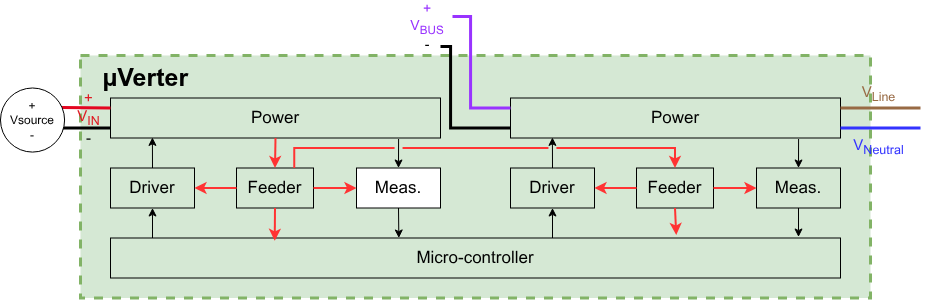

To do so, inject a voltage on the low side PV connector while observing it with a voltmeter and measuring the raw data from the USB.

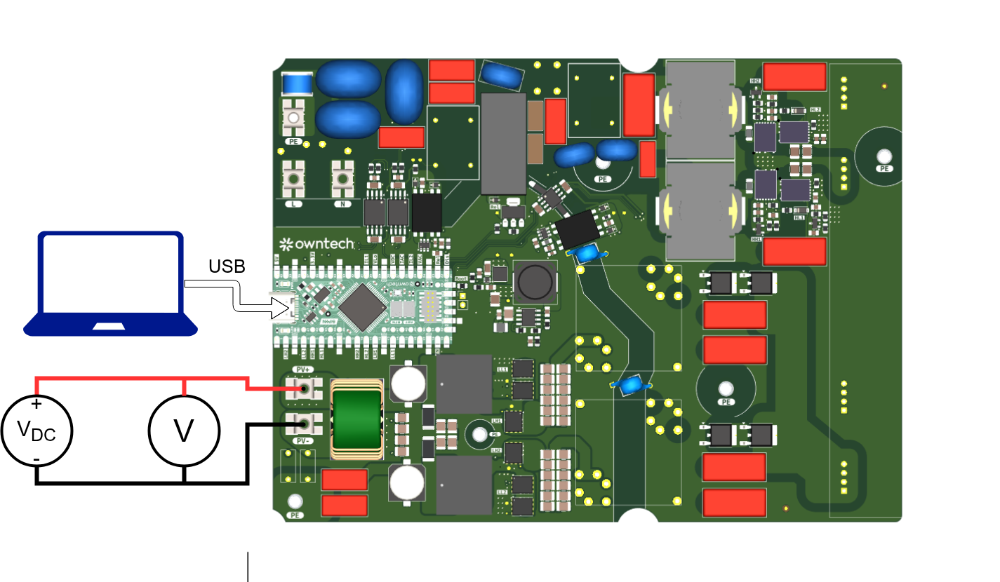

Fill up a table, calculate the gain and offset of the measurement, and store the identified transfer function for `VPV` in **D5.01**.

5.2 - Calibrate the first low-side current measurement. To do so, a resistor will be connected to the output of the first boost `LEG1`. The duty cycle will be controlled in open-loop which will inject a DC current. Monitor the applied current with an ampmeter and recording the raw value reported over USB.

Use several current setpoints **from 0 to 8A**, fill up a calibration table, then calculate the gain and offset of the `I1` measurement and store them in **D5.02**.

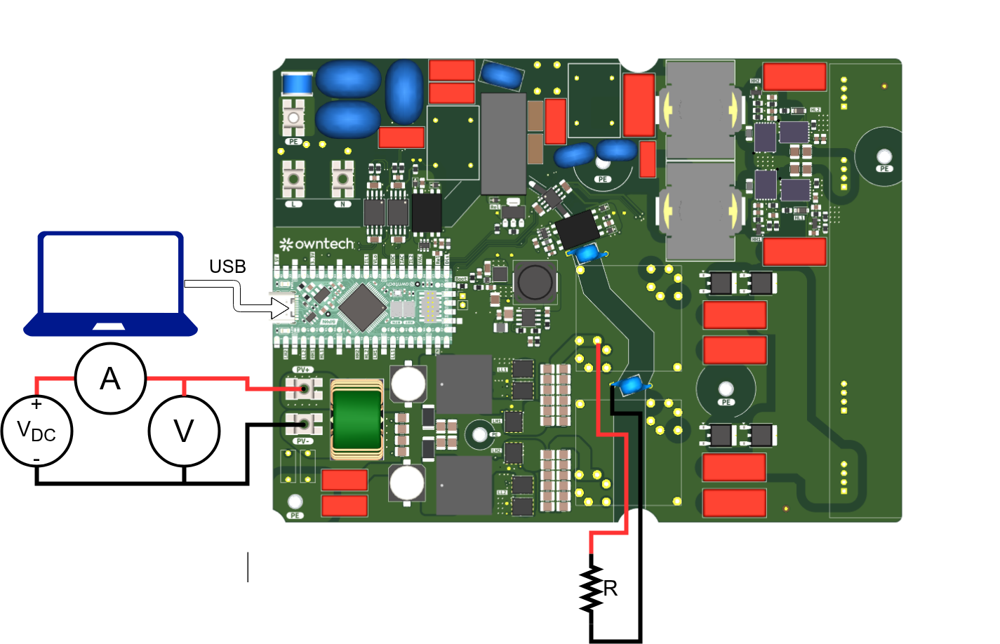

5.3 - Calibrate the second low-side current measurement. To do so, a resistor will be connected to the output of the second boost `LEG2`. The duty cycle will be controlled in open-loop which will inject a DC current. Monitor the applied current with an ampmeter and recording the raw value reported over USB.

Use current setpoints from **0 to 8 A**, fill up a calibration table, then calculate the gain and offset of the `I2` measurement and store them in **D5.03**.

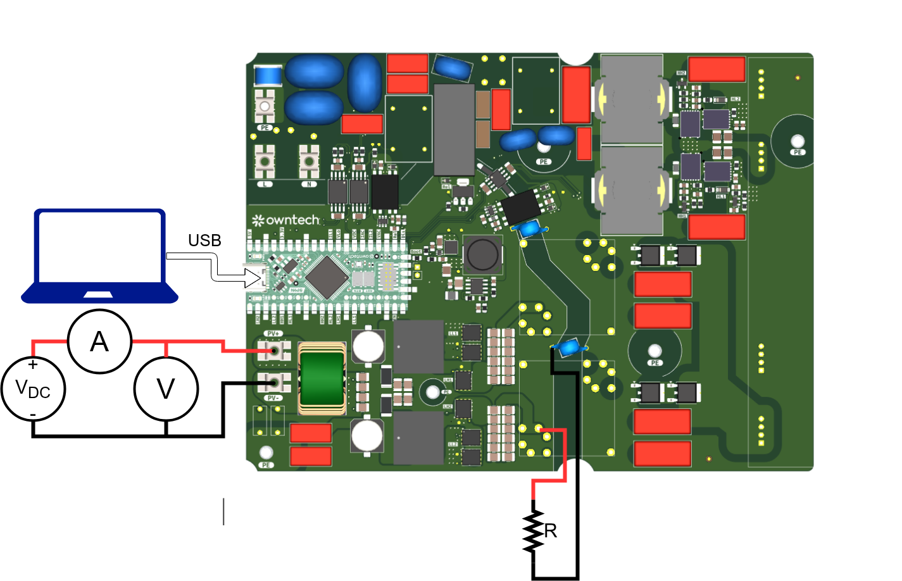

5.4 - Calibrate the high-side DC voltage measurement. To do so, injecting a known DC voltage on the bus, observing the actual bus voltage with a high-voltage voltmeter. Recording the raw data reported by the micro-controller.

> [!warning]
> Dangerous test. Make sure you fully understand the AC injection setup, isolation, and probe references before proceeding. Do not perform this test alone.

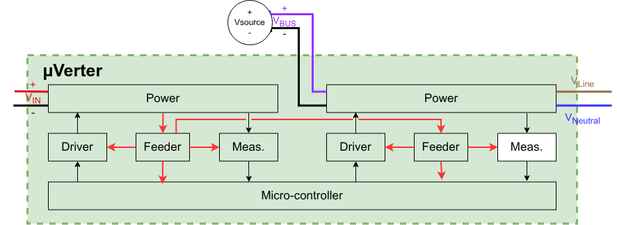

Sweep enough operating points **from 10V to 400V** to identify the parameters of the `VBus` measurement, then calculate the gain and offset and store them in **D5.04**.

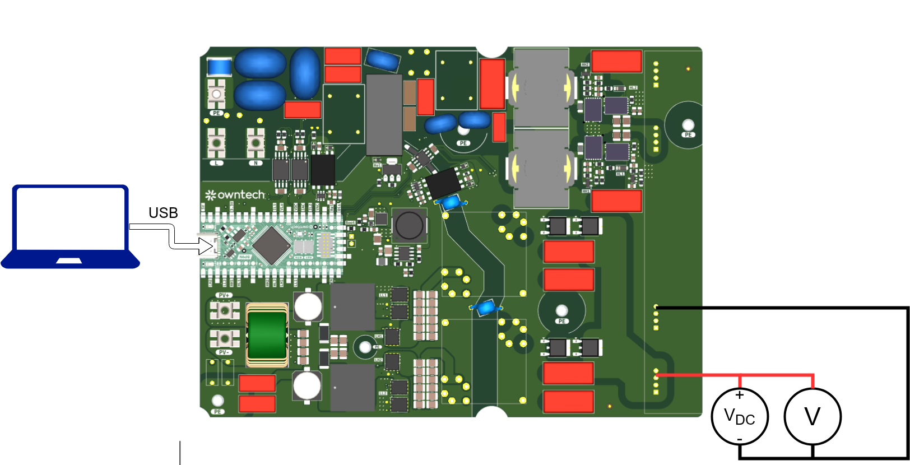

5.5 - Calibrate the high-side AC voltage measurement. To do so, inject a known AC voltage, measuring the applied `Vac` with appropriate external instrumentation, and recording the raw measurement values reported by the micro-controller.

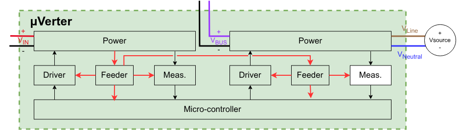

Sweep from **0 to 300VAC peak** and from **0 to 200Hz**. Calculate the gain and offset of the `Vac` measurement and store them in **D5.05**. Validate that the frequency as well. 

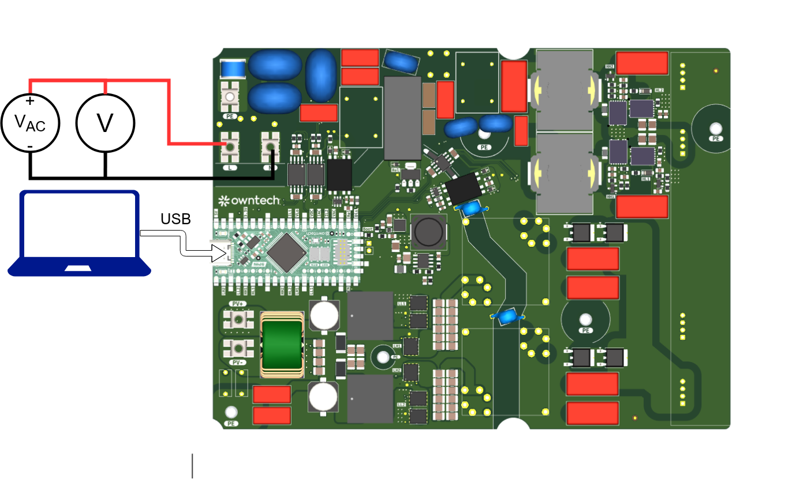

5.6 - Calibrate the high-side AC current measurement. To do so, use the same voltage source setup and connect a resistor on the pad of the missing inductor. This will force forcing an AC current to flow in the sensing path. Measure that current with appropriate external instrumentation, and record the raw value reported by the micro-controller.

Use several operating points if the setup allows it, then calculate the gain and offset of the `iAC` measurement and store them in **D5.06**.

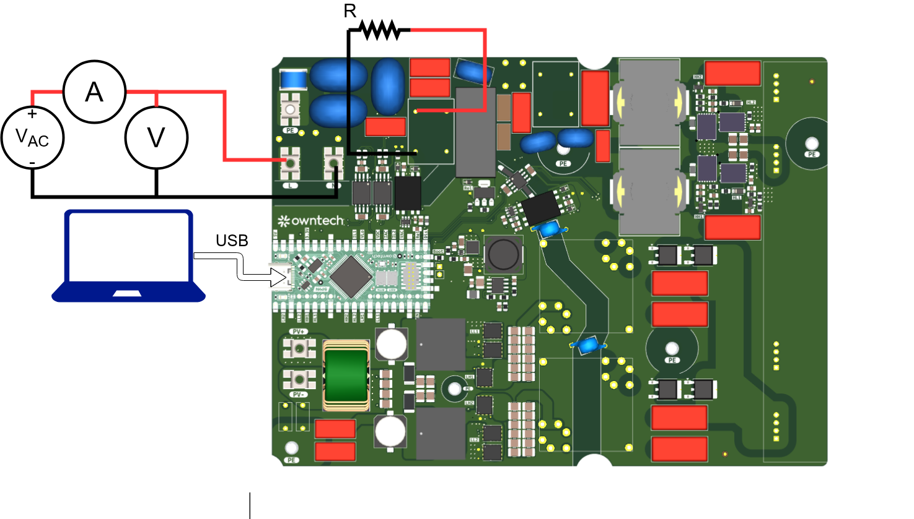

5.7 - Verify PLL measurement and estimation by the micro-controller. To do so, it will be necessary to use a dedicated micro-controller firmware that calculates the PLL using the SOGI method. Use the injected AC input after the `Vac` calibration is complete. Confirm that the estimated grid frequency and phase are stable, coherent with the applied waveform, and usable for the later DC/AC tests.

The wiring diagram for this test is the same as for the voltage calibration. 
Sweep between **10Hz to 200Hz** and validate that the PLL can measure them. 

**Deliverables**

| Deliverable | Linked Test | Parameter | Description | State |
| --- | --- | --- | --- | --- |
| D5.01 | 5.1 | `VPV` | Gain and offset identified for the low-side PV voltage measurement | TO DO |
| D5.02 | 5.2 | `I1` | Gain and offset identified for the first low-side current measurement | TO DO |
| D5.03 | 5.3 | `I2` | Gain and offset identified for the second low-side current measurement | TO DO |
| D5.04 | 5.4 | `VBus` | Gain and offset identified for the high-side DC bus voltage measurement | TO DO |
| D5.05 | 5.5 | `Vac` | Gain and offset identified for the high-side AC voltage measurement | TO DO |
| D5.06 | 5.6 | `iAC` | Gain and offset identified for the high-side AC current measurement | TO DO |

----

## Test 6 Validate the DC/DC power stage

| Item | Description |
| --- | --- |
| Objective | Validate the DC/DC power stage by preparing the hardware, running controlled open-loop testing, and characterizing regulation and ZVS behavior. |
| Entry condition | Tests 1 through 5 completed successfully and the feeder, measurement, microcontroller, driver, and energized sensing paths are already validated. |
| Exit condition | the DC/DC stage can be exercised in a controlled way, reaches the target output, and produces the required characterization data before final transformer closure. |

> List of materials
> - [ ] HF transformers
> - [ ] Oscilloscope
> - [ ] Current probe
> - [ ] `250W` rheostat
> - [ ] Thermal camera
> - [ ] Firmware or test code for DCDC open-loop operation
> - [ ] Probe wires, cables, and insulated tools
> - [ ] Fast prototyping board

**System function view for this test**

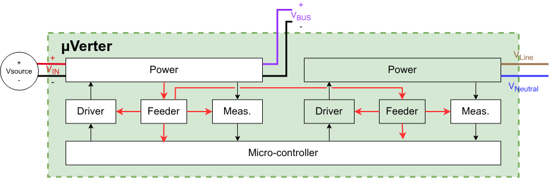
_Functions under test: both feeder sides._

**Board during test**

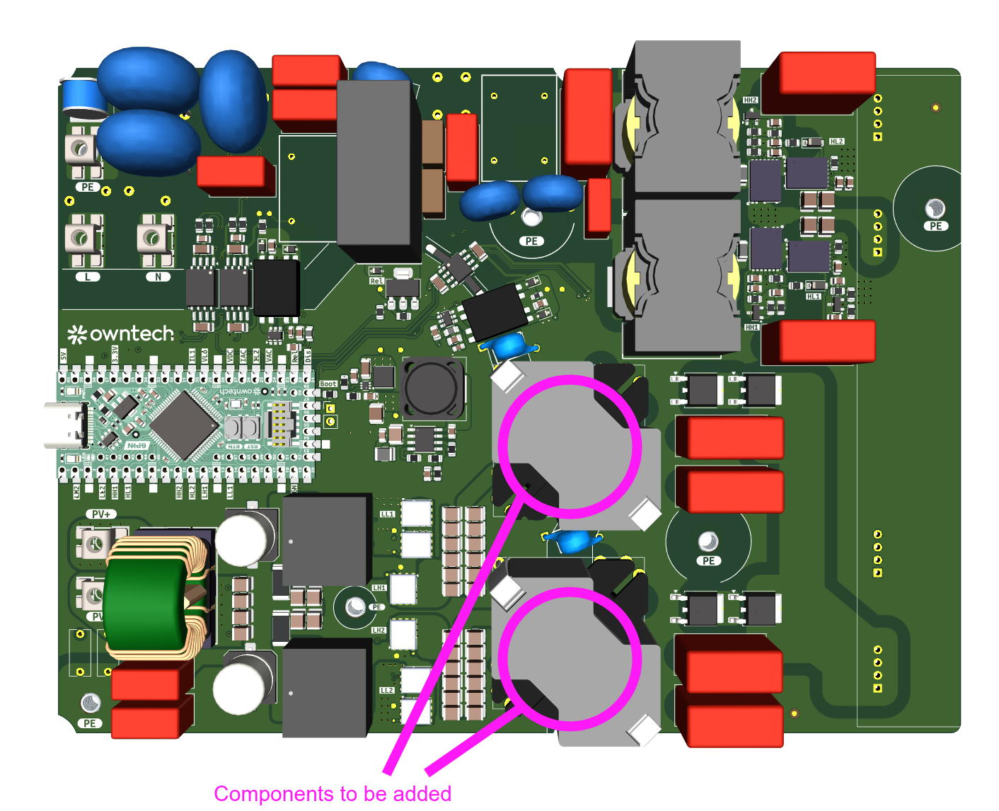
_Board during the test procedure: transformers will be added_

**Sub-tests summary**

| Test | Title | State |
| --- | --- | --- |
| 6.1 | Special transformer assembly | TO DO |
| 6.2 | Install 250W rheostat on 400V bus | TO DO |
| 6.3 | Run DCDC open-loop test code | TO DO |
| 6.4 | Raise duty cycle to 400V output | TO DO |
| 6.5 | Verify 400V output regulation | TO DO |
| 6.6 | Verify ZVS operation | TO DO |
| 6.7 | Finalize transformer installation | TO DO |

**Sub-tests**

6.1 - It is necessary to verify the Zero-Voltage Switching (ZVS) behaviour of the DC/DC stage. To to so, it is necessary to observe the current in the primary of the transformer as shown in the image below. 

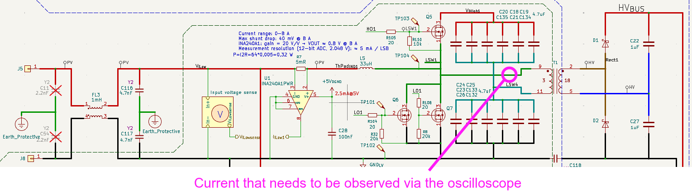
_Schematic view of the current probe insertion_

This requires mounting the transformer on top of a support, under which an oscilloscope probe can be connected.
The support should provide an space of 20mm for the current probe to be inserted.

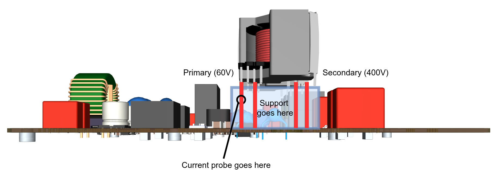
_Side view of the board with the transformer mounted above._ 

6.2 - Add a `250W` rheostat rated for `230V` between `400V-` and `400V+` so the DC/DC output can be tested under a controlled load.

> [!warning]
> Dangerous test. Make sure you fully understand the setup, the expected converter behavior, and the discharge procedure before energizing the stage. Do not perform this test alone.
> **Make sure you have a thermal camera when doing first tests**

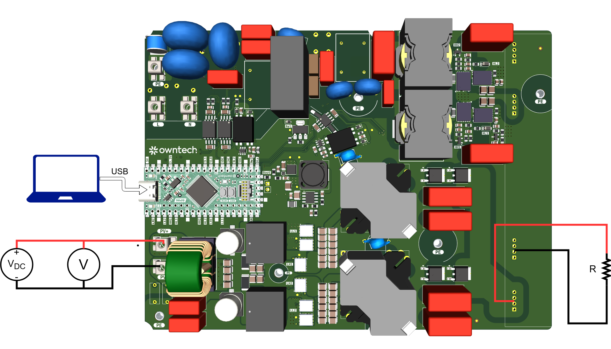

6.3 - Load the DC/DC test code that has been previously tested with a transformer for the Twist board and is available at the [Step_UP_DC_DC](https://github.com/luizvilla/Core/tree/StepUp_DC_DC) branch of Luiz Villa's github. 

6.4 - Increase slowly the duty cycle until the converter reaches `400V` on the output.

6.5 - Verify that the DC/DC stage stabilizes the output voltage at `400V`.

6.6 - Follow the test procedure to verify that the converter operates under ZVS.

<!-- What is the test procedure? -->

**Retrieve datapoints and publish a plot with P_ZVS against Vin**

**Retrieve datapoints and publish a plot with efficiency against Vin**

6.7 - When characterization is properly done and data properly saved, remove the wire and install the transformer completely.

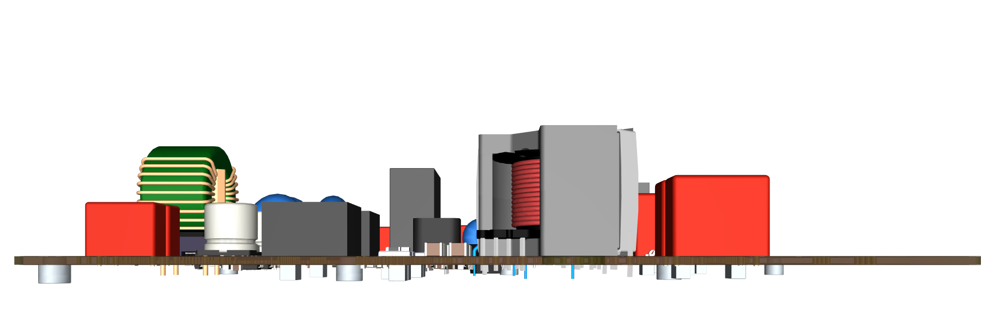

-----

## Test 7 DC/AC testing

| Item | Description |
| --- | --- |
| Objective | Validate the DC/AC stage as an integrated function by confirming sensing, PLL behavior, relay state, inverter start-up, generated sinewave, and synchronization. |
| Entry condition | Tests 1 through 6 completed successfully and the DC/DC stage has already been characterized in a controlled way. |
| Exit condition | the DC/AC stage starts correctly, produces the expected waveform, and synchronizes correctly with the grid-side reference. |

> List of materials
> - [ ] `400V` DC source with current limiting
> - [ ] `230V` AC source or isolation transformer
> - [ ] Oscilloscope
> - [ ] Isolated probes
> - [ ] Thermal camera
> - [ ] Cables, connectors, and adaptors
> - [ ] PPE for energized testing

> [!warning]
> Dangerous test. Make sure you fully understand the AC and DC sources, probe references, and synchronization measurements before proceeding. Do not perform this test alone.

**System function view for this test**

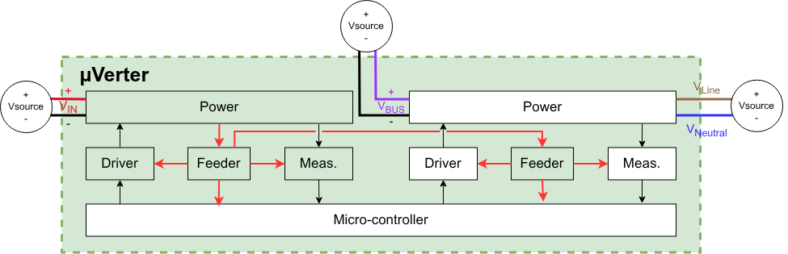
_Functions under test: DC/AC injection in open-loop._

**Board during test**

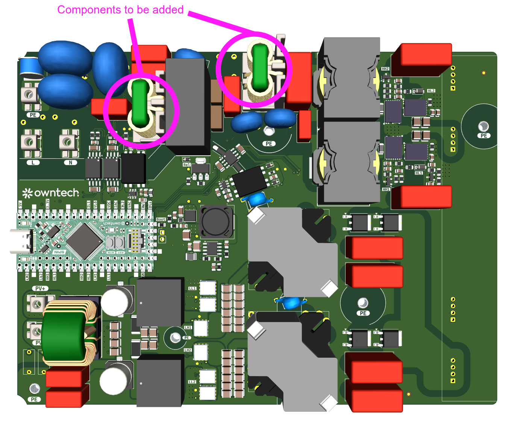
_Board during the test procedure: transformers will be added_

**Sub-tests summary**

| Test | Title | State |
| --- | --- | --- |
| 7.1 | Assemble missing parts | TO DO |
| 7.2 | Verify DC/AC conversion with no load | TO DO |
| 7.3 | Check PLL behavior | TO DO |
| 7.4 | Test the converter with a resistive load | TO DO |
| 7.5 | Start inverter and monitor thermals | TO DO |
| 7.6 | Measure generated sinewave | TO DO |
| 7.7 | Verify grid synchronization | TO DO |

**Sub-tests**

7.1 - Solder the choke inductors to the output filter to connect the high-side H-bridge to the AC output path as shown in the figure above.

> [!Attention] The inductors do not fit the current holes of the board. They need to be filed down until they fit. 

<!-- This needs a photo! -->

7.2 - Connect a high-voltage DC source in the DC-Bus. Upload a code for open-loop single phase converter operation. 

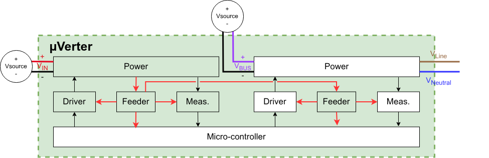

Raise the DC-Bus voltage up to `400V`. Keep the current limit very low. Validate that you have 230VRMS in the output by opening/closing the relay.

7.3 - Verify the PLL algorithm by using the output AC voltage. Vary the voltage amplitude and frequency and verify the PLL follows. Use the output of the code to run this verification or scope mimicry.

7.4 - Connect a resistive load in the output to validate the system in open-loop. Install a thermal camera to observe the system.

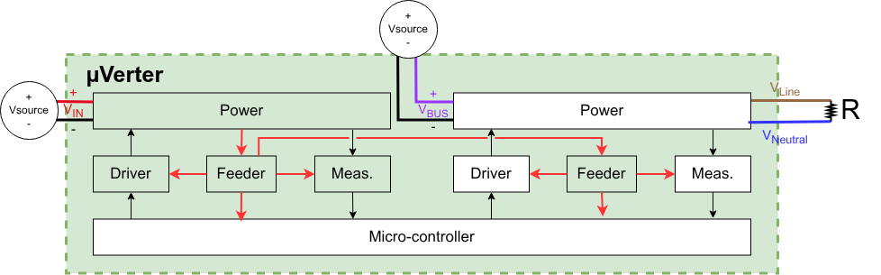

Raise the DC-Bus voltage up to `400V`. Keep the resistance high to draw a small current at first. Validate that you have 230VRMS in the output by opening/closing the relay. Lower the resistance to test the block up to nominal power (500W).

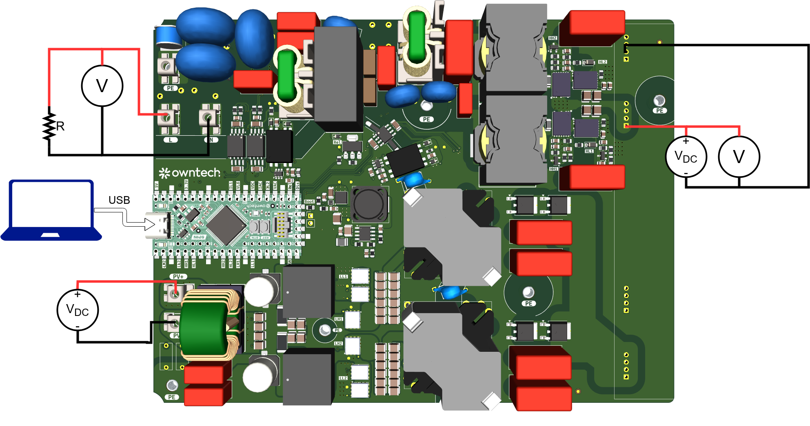

7.5 - Test the grid-forming closed-loop control of the inverter with a resistive load. 

Use the grid-forming code to validate that the converter creates a 230VRMS output that is independent of the load.

7.6 - Intermediary test to validate that the converter can be used in grid-forming with a transformer to control the output of a resistive load.

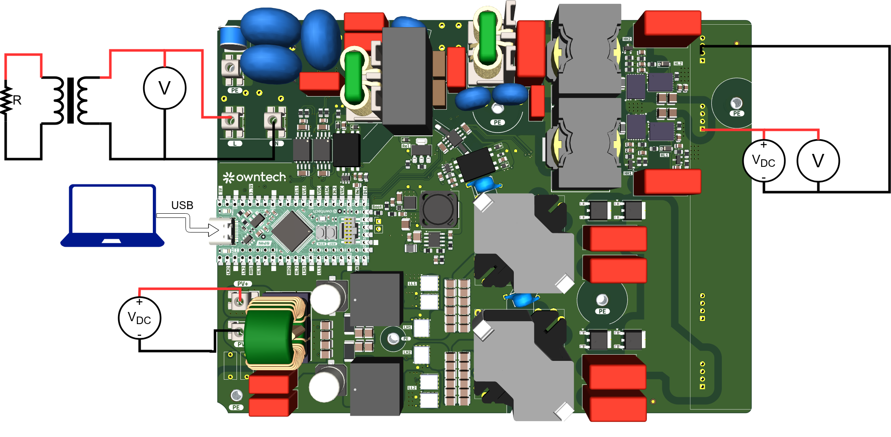

Here the inverter is connected to a resistor via a step-down transformer. Validate that the converter can generate a sine wave on the resistor level. 

7.7 - Test the grid-following code to validate the converter can synchroize and inject into an isolated grid. 

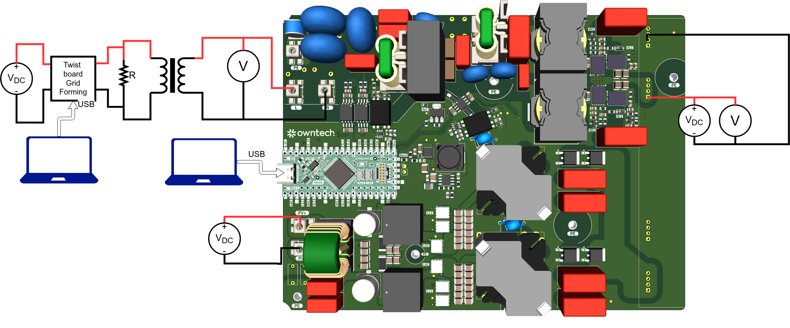

Use a Twist board as a grid forming to create a sine wave on low-voltage side of the transformer. 
Validate that the converter can syncronize with this sine-wave.
Once in sync, connect the relay and inject a small amount of power into the system. 

7.8 - Test that the system can inject into the local grid. Disconnect the inverter's relay and verify that it can sync to the local grid. Once the synchronization in place, connect the relay and inject a small amount of power. Raise the power up to reach nominal 500W.  

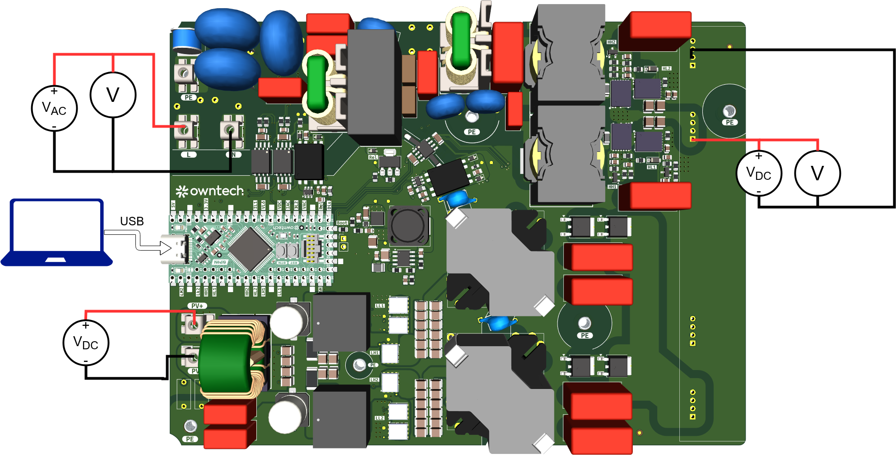

-----

## Test 8 Mount capacitors, and common-mode choke

| Item | Description |
| --- | --- |
| Objective | Complete the assembly only after the main functional validation steps have succeeded and confirm the prototype is ready for the next level of integration. |
| Entry condition | Tests 0 through 7 completed successfully and the major converter functions have already been validated. |
| Exit condition | the final passive parts are mounted and the board is ready for integration testing as a fully assembled prototype. |

> List of materials
> - [ ] Common-mode choke
> - [ ] PP capacitors
> - [ ] Assembly tools
> - [ ] Fasteners or mounting hardware
> - [ ] Visual inspection tools
> - [ ] Multimeter

**System function view for this test**

_Functions under test: both feeder sides._

**Sub-tests summary**

| Test | Title | State |
| --- | --- | --- |
| 8.1 | Mount common-mode choke and PP capacitors | TO DO |
| 8.2 | Confirm readiness for integration test | TO DO |

**Sub-tests**

8.1 - Mount common-mode choke and PP capacitors after the earlier functional gates have been passed.

8.2 - Confirm that the board is ready for integration testing.

